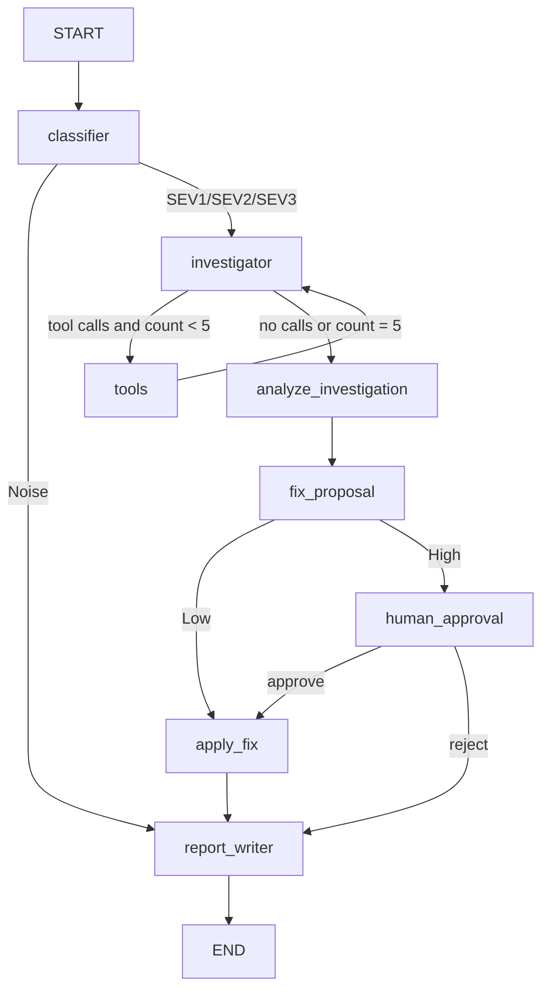

# DevOps Incident Response Commander

Small LangGraph incident-response system for classifying alerts, investigating with mock tools, proposing a fix, and requiring human approval before risky actions.

## Setup

```powershell
python -m venv .venv
.venv\Scripts\Activate.ps1
pip install -r requirements.txt
Copy-Item .env.example .env
```

Set `GROQ_API_KEY` in `.env`. The repository contains no API keys and uses no external service other than the configured LLM provider. All investigation and runbook tools are deterministic mocks.

## Run All Scenarios

From the repository root:

```powershell
python -m app.run
```

This command saves the compiled graph diagram to `graph.mmd`, runs all four scenarios, and prints each path, tool list, and final report. Scenario 3 and scenario 4 each use two graph calls: the first pauses at `interrupt()`, and the second resumes the same `thread_id` with `Command(resume="approve")` or `Command(resume="reject")`.

## Architecture




## Nodes and Routing

- `classifier`: uses structured Pydantic output to select `SEV1`, `SEV2`, `SEV3`, or `Noise`.
- `investigator`: an LLM with `bind_tools`; its messages are accumulated with the `add_messages` reducer.
- `tools`: a LangGraph `ToolNode` executes requested mock tools and loops back to the investigator.
- `analyze_investigation`: produces evidence, root cause, and confidence.
- `fix_proposal`: chooses a fixed action. Confidence below `0.6` always produces a High-risk proposal.
- `human_approval`: calls `interrupt()` for High-risk fixes.
- `apply_fix`: plain Python calls `execute_runbook`, with no LLM involved.
- `report_writer`: creates and stores `final_report`, including fix result, tools, and rejection escalation.

The graph uses conditional edges for classifier routing, the investigator/tool loop, fix risk, and approval. The investigator tool loop cannot execute more than five tool calls: a final tool batch is truncated to the remaining budget, and `tool_call_count` and `tools_used` are stored in state.

## State Design

`IncidentState` is a `TypedDict` containing the alert, severity, reducer-backed investigator `messages`, reducer-backed `visited_nodes`, evidence summary, root cause, confidence, proposed fix, risk, approval decision, fix result, escalation status, final report, tool names, and tool-call count. Each node returns only the fields it owns plus its path marker.

The graph is compiled with `MemorySaver`. Every scenario supplies a unique `configurable.thread_id`, so LangGraph can persist the interrupted state and resume it in a later call.

## Mock Tools

- `query_logs(service)` returns fixed recent log lines.
- `get_metrics(service)` returns fixed CPU, memory, disk, and error-rate values.
- `get_recent_deployments(service)` returns fixed deployment history.
- `execute_runbook(action, service)` returns fixed `success` or `failed` results.

All results are keyed by service so repeated runs produce the same evidence.

## Required Scenario Evidence

1. **Recovered CPU spike:** `report-worker` is classified as Noise and follows `Classifier -> Report Writer`; no tools or fix run.
2. **Database disk usage:** `db-primary` follows `Classifier -> Investigator <-> Tools -> Analyze Investigation -> Fix Proposal (Low) -> Apply Fix -> Report Writer`; the clear-logs runbook succeeds.
3. **Rollback approved:** `checkout-service` follows the investigator/tool loop, proposes High-risk rollback, pauses at Human Approval, then resumes with `approve`, applies the rollback, and reports success.
4. **Rollback rejected:** the same High-risk path pauses and resumes with `reject`; Apply Fix is skipped and the final report marks the incident as escalated to the on-call engineer.

## Tests

Run the deterministic unit checks with:

```powershell
python -m pytest -q
```

The four end-to-end LLM scenarios are run with `python -m app.run`; their printed paths and reports are the submission evidence.